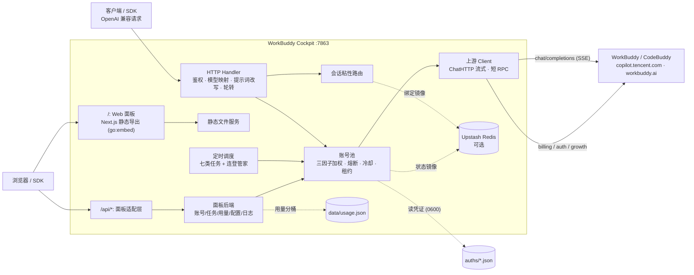

<div align="center">


# WorkBuddy Cockpit

**把 WorkBuddy / CodeBuddy 账号变成 OpenAI 兼容 API，并且管好这一切**

多账号网关 · 内嵌 Web 管理面板 · 任务自动化 · 用量可观测 · 单容器部署

[](https://github.com/Arimayuki03/workbuddy-cockpit/releases/latest)
[](https://github.com/Arimayuki03/workbuddy-cockpit/releases/latest)
[](https://github.com/Arimayuki03/workbuddy-cockpit/actions/workflows/build.yml)
[](LICENSE)
[](https://go.dev)
[](web/)
[](https://github.com/Arimayuki03/workbuddy-cockpit/pkgs/container/workbuddy-cockpit)
[](https://github.com/Arimayuki03/workbuddy-cockpit/stargazers)

**简体中文** · [功能总览](#-功能总览) · [快速开始](#-快速开始) · [配置](#️-配置) · [架构](#️-架构总览) · [版本](#-版本) · [文档](#-文档) · [免责声明](#️-免责声明)

</div>

---

## 📖 项目简介

WorkBuddy Cockpit 是一个自托管的一体化项目：**后端**是多账号 OpenAI 兼容网关（OAuth 登录、账号池轮转、熔断与冷却、会话粘性），**前端**是内嵌进同一个二进制的全功能 Web 管理面板（账号、任务、用量、配置、日志），部署一个容器、记住一个地址，全部搞定。

> 前身是 [Sliverkiss/workbuddy2api](https://github.com/Sliverkiss/workbuddy2api) 的 fork（**上游仓库自 2026-09-23 起已被作者删除、不可访问**，链接仅为历史署名；本项目按 MIT 独立继续演进）。v1.2.0 起项目以独立形态演进：吸收 [workbuddy2api-panel](https://github.com/linguo2625469/workbuddy2api-panel) 的后端管理能力与 [workbuddy-manager](https://github.com/ithtelab/workbuddy-manager) 的前端设计，网关核心与上游保持同源兼容。设计决策见 [docs/DESIGN-v1.2.0-panel-manager.md](docs/DESIGN-v1.2.0-panel-manager.md)。

### 与上游 / 同类项目的关系

| | 上游 workbuddy2api | workbuddy2api-panel | workbuddy-manager | **本项目** |
|---|---|---|---|---|
| 形态 | 纯网关，无面板 | 网关 + 原生 HTML 面板 | 外挂面板（Python 中间层 + Next.js） | **网关 + 内嵌 Next.js 面板** |
| 部署 | 单容器 | 单容器 | 网关 + 面板双容器 | **单容器** |
| 账号池治理 | ✓ | ✓ | —（调网关 API） | ✓（上游同源 + cost_explore） |
| 任务自动化 | ✓ 内置六类调度 | ✓ 全内置 | 依赖 Python 脚本 | ✓ 内置调度 + 成长任务/顺序任务链/开学季一键自动化 |
| 用量统计 | `/v1/stats` 聚合 | 逐请求分桶 | 自建 SQLite | **两者都有** |
| Windows 工作流 | ✓ cmd 启停脚本 | — | 脚本 | ✓ cmd 启停 + bat 交互菜单 + CLI 全套 |

## ✨ 功能总览

### 🎛️ Web 管理面板

浏览器打开即用，与网关同端口同鉴权，明暗主题，简中 / 繁中 / 英 / 日 / 韩五语言：

- **总览** — 账号健康分布、今日请求 / token / 积分扣费一目了然；到期积分按天归并口径切换（本地偏好）
- **账号** — 池总览（状态 / 积分进度条 / 冷却倒计时 / 成功失败计数 / 在途数）；单号禁用 / 恢复 / 复活 / 签到 / 查余额 / 移除；批量签到 / 保活 / 余额刷新；**扫码 / 授权登录添加账号**，凭证落盘后热加载进池，免重启；**凭据导出 / 导入**（跨部署迁移账号，同 UID 覆盖更新）；**强制清冷却**（冷却 / 熔断 / 连败降权 / 模型级限流一键归零，不碰禁用位）
- **任务** — 成长任务一键自动化（25 个任务动作纯 API 完成：推进 → 轮询计分 → 自动领奖，执行队列账号内串行、账号间并发；含小程序 Sequential_Tasks_1..7 顺序任务链——专家对话、5/10 次对话、GLM5.2、灵感功能等，链式依赖每日解锁自动重试，**锁定环不扫入待办**）；开学季活动 5 任务一键闭环 + **券码二维码**；七类定时任务快照与手动触发
- **统计** — 逐请求用量分桶（时间片 × 域 × 账号 × 模型）时间轴图表 + 按模型聚合的请求量 / token / 延迟 / 扣费；时间窗筛选图和表同步生效；时间窗含近 24h / 72h / 7d / 30d 数字档与「启动以来」全量档
- **日志** — 请求日志（模型 / 账号 / 状态 / tokens / 首字延迟 / 扣费 / 错误 / **prompt 缓存命中三段观测**，环形缓冲最近约 1000 条）+ 系统日志（任务 / 对话 / 系统三频道）
- **设置** — 配置热编辑（深合并原子写回，部分键立即生效，排程小时免重启热改）、Upstash 连通性测试、**模型映射**（自定义模型名 → 真实模型，服务 cc-switch 等写死模型名的客户端）、版本检查提示
- **Playground** — 面板内直接对话测试，走本网关 `/v1/chat/completions`

### 🐝 账号池治理

- **OAuth 设备授权登录** — `login.sh` / 面板内扫码加号，token 自动刷新、凭证落盘、热加载
- **三因子加权随机选号** — 积分比例 ×10 + 快过期积分占比 ×8 + 闲置补偿，Top-5 候选短名单内抽签，防惊群；`pool.pick_strategy` 可切换 `credits_desc` 余额从大到小严格选号（面板热生效；粘性会话的首次分配同样遵循策略，credits_desc 下新会话绑余额最高号）
- **在途租约** — 单号最大并发占用限制；`/status` 透出 `in_flight_by_model` 每模型在途台账
- **账本择优** — 按 `usage.credit` 折算每千 token 单价记入 (账号， 模型) 账本，免费 / 便宜的号优先，观测 EMA 平滑、6h 失效
- **成本分层条件探索** — tier 0 垄断时搭车改道探索未知号，承接真实请求零新增上游调用，成功即毕业
- **分级熔断与冷却** — 429 软冷却指数退避、402 硬冷却至次日 04:00（不被软冷却 / 限流覆盖翻型，零余额号不会提前回池）、连败熔断、模型级限流独立冷却（切模型豁免）、WAF IP 级 fail-fast；运维可从面板**强制清冷却**。签到 / 余额刷新自动解冻只清账号级冷却，不重置软限流退避指数与模型级台账（余额恢复不证明 chat 通道健康，避免零余额号反复回池撞 429）
- **会话粘性** — conversation 四键 → prompt_cache_key → 首条 user 消息派生，多轮上下文不跳号；粘性按模型判活
- **双域适配** — 国内版（`copilot.tencent.com`）与国际版（`www.workbuddy.ai`）共享一池，按 realm 或模型名前缀路由

### ⏰ 定时积分任务

七类任务独立排程、独立开关（`schedule.*_enabled`），**触发小时可在面板 / API 热改（免重启）**：签到（09/21 点，尾部自动跑连登管家：7/14/28 档自动兑换 + 抽奖自动抽完）、活跃地图（10 点）、猫猫旅行（09/21 点，领养状态机修正）、token 保活（22 点）、开学季（12 点）、夜猫子（01 点）、任务执行队列（10 点，默认关）。面板与 `/admin/tasks` 均可手动触发；单任务 panic 有 recover 兜底，不会击穿网关进程。

### 🔌 OpenAI 兼容接口

- `/v1/chat/completions` 流式 + 非流式（出站强制 stream，SSE 白名单重建，非流式本地聚合）、`/v1/models`（effort 档位 / 积分倍率 / 上下文全字段）、`/v1/stats`、`/status`、`/healthz`
- 出站改写管线：强制 `stream:true`、`developer` 角色归一、tool_choice 归一、`image_url` 字符串兼容、DeepSeek 思维链注入、`reasoning_effort` 档位降级、`reasoning_content` 回填、指纹脱敏、**prompt 缓存命中别名归一**（部分上游 `details.cached_tokens` 有真值而扁平别名留 0 时取全部别名最大正值回写，下游不再误判未命中）
- 系统提示词三模式（passthrough / custom / append）+ 内容拦截降级重试
- 模型映射、错误分类轮转退避；国际版模型目录**双 UA 并发探测取并集**（IDE UA 字段权威、CLI UA 补 deepseek 系缺失 id），试用横幅模型自动补入目录；上下文窗口按「远端权威 → 静态知识表 → model.json 缓存 → models.dev 按需拉取」四级回退

### 🖥️ Windows 原生工作流

**启动服务.bat** 交互菜单（积分 / 签到 / 任务 / 启停 / 日志 / 加号 / 统计 / 账号运维），`login.exe` / `credit.exe` / `acct.exe` / `stats.exe` / `task.exe` 等 CLI 全套；源码模式 `go run ./cmd/server` 即跑。详见 [使用指南.md](使用指南.md)。

## 🚀 快速开始

### 方式一：Docker Compose（推荐）

```bash
git clone https://github.com/Arimayuki03/workbuddy-cockpit.git
cd workbuddy-cockpit
mkdir -p config && cp config.example.json config/config.json
# 编辑 config/config.json：至少设置 api_key；开启 panel 或 admin 时 api_key 必填（缺失 fail-fast）
docker compose up -d --build

# 打开面板
# http://localhost:7863/   →  登录密码 = 你设置的 api_key
```

> 也可以用 CI 预构建镜像 `ghcr.io/arimayuki03/workbuddy-cockpit:latest`（多架构 amd64/arm64；把 compose 里的 `build: .` 换成 `image:` 即可）。ghcr 镜像由 [Build & Publish](.github/workflows/build.yml) 在每次打 `v*` tag 时发布；发行版二进制（Windows zip / Linux / macOS，含任务工具 exe 与 sha256 校验）随 Release 资产自动上传。若拉取不到镜像，Workflow 页面另有 amd64 离线 tar.gz 供下载。

添加账号：面板「账号」页扫码 / 授权登录，或 `./login.sh`。

### 方式二：源码构建

```bash
# 前端面板（需要 Node 22+，产物 embed 进二进制）
cd web && npm ci && npm run build:export && cd ..
cp -r web/out internal/panel/dist   # Windows: robocopy /MIR web\out internal\panel\dist

# 后端（-tags embed_panel 启用面板内嵌；无该 tag 则为纯网关构建）
go build -trimpath -tags embed_panel -ldflags="-s -w" -o wb2api ./cmd/server
./wb2api -config config.json
# 开发态直跑：go run ./cmd/server -config config.json
```

> ⚠️ `go build` 开启 `-tags embed_panel` 而 `internal/panel/dist/` 缺失时**编译直接报错**（fail-fast：不嵌入残缺前端），请先完成前端构建与拷贝。

### 方式三：Windows 一键脚本

双击 **启动服务.bat** 交互菜单即可（自动编译所需工具、自动检测端口与僵死进程）。发行版 exe 双击即可用：配置文件不存在时首启引导会自动生成带随机 `api_key` 的最小 `config.json` 并打印密钥（双击报错窗口保持可见）。详见 [使用指南.md](使用指南.md)。

### 验证

```bash
# 网关身份与健康
curl -s http://localhost:7863/healthz

# 模型列表 / 账号状态 / 请求统计
curl -s http://localhost:7863/v1/models  -H "Authorization: Bearer your-api-key"
curl -s http://localhost:7863/status     -H "Authorization: Bearer your-api-key"
curl -s http://localhost:7863/v1/stats   -H "Authorization: Bearer your-api-key"

# 流式聊天
curl -sN http://localhost:7863/v1/chat/completions \
  -H "Authorization: Bearer your-api-key" -H "Content-Type: application/json" \
  -d '{"model":"deepseek-v4-flash","messages":[{"role":"user","content":"hi"}],"stream":true}'
```

### 接入客户端

以 **cc-switch**（Claude Code 等 Anthropic 协议客户端的本地转换器）为例：

- **Base URL**：`http://127.0.0.1:7863/v1`，**API Key**：`config.json` 的 `api_key`
- **模型映射建议**：Default / Sonnet / Opus → `deepseek-v4-pro`；Haiku / Subagent → `deepseek-v4-flash`
- 客户端写死的模型名（如 `gpt-4o`）可在面板 `/settings` 模型映射里整名映射到网关模型

## ⚙️ 配置

配置以 [`config.example.json`](config.example.json) 为完整参考，`WB2A_*` 环境变量可覆盖（28 个，含 `WB2A_CONFIG` 指定配置路径）。常用段：

```jsonc
{
  "listen": ":7863",            // 监听地址
  "api_key": "your-gateway-key", // 网关鉴权 key（panel/admin 开启时必填，缺失拒绝启动）
  "auth_dir": "./auths",        // 账号凭证目录（5s 轮询热加载）
  "upstash": { "url": "", "token": "" }, // 状态镜像到 Upstash Redis（可选）
  "usage":   { "enabled": true },  // 逐请求用量分桶落盘 data/usage.json
  "panel":   { "enabled": true, "loopback_only": false }, // Web 管理面板
  "schedule": { "checkin_enabled": true, "checkin_hours": [9, 21], "queue_enabled": false } // 七类任务排程（面板可热改）
}
```

| 新增键 | 默认 | 说明 |
|---|---|---|
| `panel.enabled` | `true` | 启用 Web 面板（关掉即回到纯网关形态） |
| `panel.loopback_only` | `false` | 面板仅限本机回环访问（公网反代场景保持 false） |
| `usage.enabled` | `true` | 逐请求用量分桶统计（关掉则统计页只剩 `/v1/stats` 聚合） |
| `schedule.queue_hours` / `queue_enabled` | `[10]` / `false` | 任务中心执行队列排程（默认关；面板任务页可手动触发） |
| `pool.pick_strategy` | `weighted` | 选号策略：`weighted` 三因子加权随机 / `credits_desc` 余额从大到小严格选号（面板设置页热改，免重启） |

安全契约：`panel.enabled` 或 `admin.enabled` 为 true 且 `api_key` 为空时**拒绝启动**。面板与 API 同端口同鉴权，自带严格 CSP 等安全头；登录失败限速（按 IP 10 分钟内 5 次失败锁定 15 分钟，防 api_key 在线穷举）；公网部署务必设置 api_key 并置于 HTTPS 反代之后。

> ⚠️ 合规须知：本项目是**非官方**网关，使用 WorkBuddy / CodeBuddy 账号作为上游，**仅限本人授权账号、本机 / 私有环境测试**。详细边界见[免责声明](#️-免责声明)。

## 🏗️ 架构总览



上游请求在出站前经历统一的改写管线（`internal/upstream/payload.go`）：强制 `stream:true`、`developer` 角色归一、tool_choice 归一、`image_url` 字符串兼容为 OpenAI 对象形态、DeepSeek 思维链注入、`reasoning_effort` 档位降级、`reasoning_content` 回填、指纹脱敏。

### 目录结构

```
workbuddy-cockpit/
├── cmd/                  # CLI 工具源码（server 网关 / login / credit / acct / stats / task …）
├── internal/             # 核心库（auth / pool / scheduler / server / upstream / panel / usage …）
├── web/                  # Next.js 15 面板前端（静态导出后 go:embed 内嵌）
├── scripts/              # 辅助脚本（Python 任务体 / PowerShell 服务启停）
├── docs/                 # 设计文档
├── config.example.json   # 配置模板（复制为 config.json 后填 api_key）
├── docker-compose.yml    # Docker 一键部署
├── Dockerfile            # 三段构建：node:22 → golang:1.26 → alpine:3.20
└── LICENSE               # MIT
```

## 📚 文档

| 文档 | 内容 |
|---|---|
| [使用指南.md](使用指南.md) | 启停 / 配置 / 账号管理 / 接口验证 / 面板用法（含凭据导入导出）/ 常见问题排查 |
| [docs/DESIGN-v1.2.0-panel-manager.md](docs/DESIGN-v1.2.0-panel-manager.md) | v1.2.0 面板整合设计定稿 |
| [config.example.json](config.example.json) | 全量配置键参考（含注释级说明） |

## 🔄 版本

| 版本 | 日期 | 说明 |
|---|---|---|
| v1.0.0 | 2026-09-14 | 上游基线（Sliverkiss/workbuddy2api），ghcr 镜像发布流程 |
| v1.1.0 | 2026-09-20 | 吸收上游 2026-09-20 合并：`/v1/stats`、账号停用/恢复/复活端点、auths 热加载、global 域路由 |
| v1.1.1 | 2026-09-20 | `/status` 透出 `in_flight_by_model` 每模型在途台账 |
| v1.2.0 | 2026-09-22 | **项目更名 WorkBuddy Cockpit**；整合 Web 管理面板（panel 后端 + manager 前端壳）、模型映射、请求日志、版本检查；吸收上游两段式治理流水线、`image_url` 兼容等。网关侧 `/v1/*`、`/admin/*`、`/status` 接口契约保持完全兼容 |
| v1.2.1 | 2026-09-23 | 用量页时间窗修复：新增「启动以来」全量档、切窗竞态修复、Y 轴刻度遮挡修复 |
| v1.3.0 | 2026-09-23 | **账号凭据导出 / 导入**——跨部署迁移账号（同 UID 覆盖更新，导出格式与落盘同形） |
| v1.12.0 | 2026-09-24 | 账号表列排序（本地偏好持久化）、日志页昵称列与昵称搜索、仪表盘积分排序扩容、学院抽奖 `draw_uuid` 修复（标准 uuid v4 + 回归测试） |
| v1.13.0 | 2026-09-26 | **选号策略手动切换**——`pool.pick_strategy` 新增 `credits_desc`（按积分余额从大到小严格选号，面板设置页下拉，热生效免重启），默认 `weighted` 行为不变 |
| v1.14.0 | 2026-09-26 | **吸收两上游修复 + 发行流程固化**——任务待办过滤 locked 环（顺序任务链不再空跑）、签到解冻不再重置软限流退避与模型级冷却（旧语义下零余额号被误判健康回池再撞 429）、usage 缓存命中别名归一（部分上游 `cached_tokens` 真值不再被误判未命中）；CI 打 `v*` tag 自动构建四平台二进制 + 任务工具 exe + sha256 上传 release 资产，镜像 / 二进制统一注入版本号 |

完整变更见 [Releases](https://github.com/Arimayuki03/workbuddy-cockpit/releases)。

## 🙏 致谢

- [Sliverkiss/workbuddy2api](https://github.com/Sliverkiss/workbuddy2api) — 网关核心的上游基座（本 fork 的起点；上游仓库已删库下线，署名依 MIT 保留）
- [linguo2625469/workbuddy2api-panel](https://github.com/linguo2625469/workbuddy2api-panel) — 面板后端能力（账号池视图 / 任务自动化 / 开学季 / 用量分桶 / OAuth 加号 / 配置热编辑）的移植源（MIT）
- [ithtelab/workbuddy-manager](https://github.com/ithtelab/workbuddy-manager) — 前端面板设计与页面结构的来源（MIT）；其 UI 设计 token 与组件层改编自 [linux-do/cdk](https://github.com/linux-do/cdk)（MIT），一并致谢

## ⚠️ 免责声明

本项目（包括但不限于代码、脚本、文档、配置示例及仓库内任何资源，下称「本项目内容」）**仅供个人学习与研究使用**。使用本项目表示您已阅读并接受本声明全部条款；如不同意，请立即停止使用并删除全部相关内容。

**1. 用途限制。** 本项目内容仅可用于个人学习、研究等非商业用途；请勿将本项目用于任何商业目的或牟利行为，请勿违反所属国家 / 地区 / 组织的任何法律法规。本项目不构成对任何软件、服务、平台的使用建议或授权。

**2. 账号与数据责任。** 本项目可能涉及个人账号凭证的获取、存储与使用。您应仅使用本人持有且已获授权的账号，自行确认相关平台的服务条款与允许范围，并自行承担使用、存储凭证（如 `auths/` 中的文件）及调用上游服务所产生的全部责任与风险。本项目不参与、不介入您与任何平台之间的契约关系。

**3. 内容与第三方界限。** 本项目内容中引用的第三方产品、服务、LOGO、图片、文案等，其权利均归各自权利人所有；本项目不保证此类内容的准确性、完整性、合法性，亦不代表支持或推荐任何第三方。如实存在侵权情形，请通过 Issues 告知，经核实后本项目会尽快处理。

**4. 无担保与风险自担。** 本项目内容按「现状」提供，不附带任何明示或默示的担保（包括但不限于适销性、特定用途适用性、准确性、不侵权等）。使用本项目（包括直接或间接）所产生的任何风险与后果（包括但不限于账号异常、数据丢失、服务中断、纠纷或损失），均由使用者自行承担，与本项目及其全部贡献者无关。

**5. 责任限定。** 在任何情况下，本项目及其作者、贡献者均不对任何直接、间接、偶然、特殊或后果性损害承担责任，无论该等损害是否基于合同、侵权或其他法律理论，即使已被告知发生该等损害的可能性。

**6. 修改与分发。** 基于本项目源代码进行的任何修改、衍生均系第三方自发行为，与本项目无关，相应后果由该第三方自行承担。本项目内所有资源文件，禁止任何公众号、自媒体进行任何形式的转载、发布。未经授权，任何组织或个人不得将本项目内容用于转载、发布或再分发。

**7. 条款变更。** 本项目保留随时修改、补充本声明的权利。修改后的声明自发布之日起生效，继续使用本项目即视为接受修订后的声明。本项目所有内容仅供学习和研究使用，请于学习研究完成后及时删除。

## 📄 License

本项目采用 [MIT License](LICENSE) 开源协议。

- 在遵守 MIT License 前提下，允许使用、复制、修改、合并本项目源代码
- 再分发（源码或二进制形式）时，须保留本项目及上游 Sliverkiss/workbuddy2api、workbuddy2api-panel、workbuddy-manager 的 MIT 版权声明与许可声明
- 本项目不授予任何上游（WorkBuddy / CodeBuddy）接口或服务的权利；使用者仍需自行遵守上游服务条款
- 本项目的使用同时受上方**免责声明**约束；如免责声明与 MIT License 存在不一致，以免责声明为准

---

<div align="center">

如果这个项目对你有帮助，欢迎点一个 ⭐

</div>
