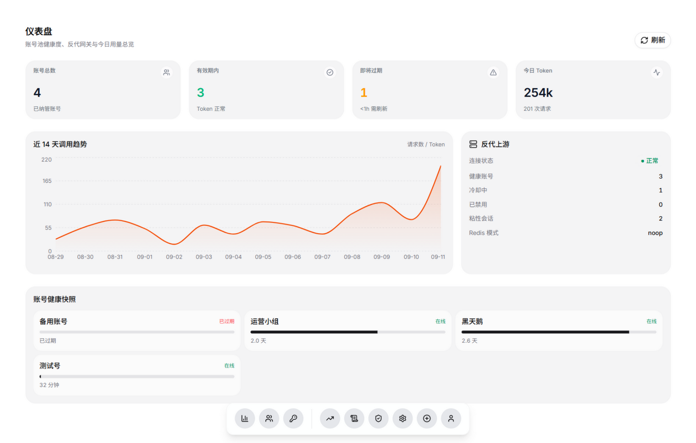
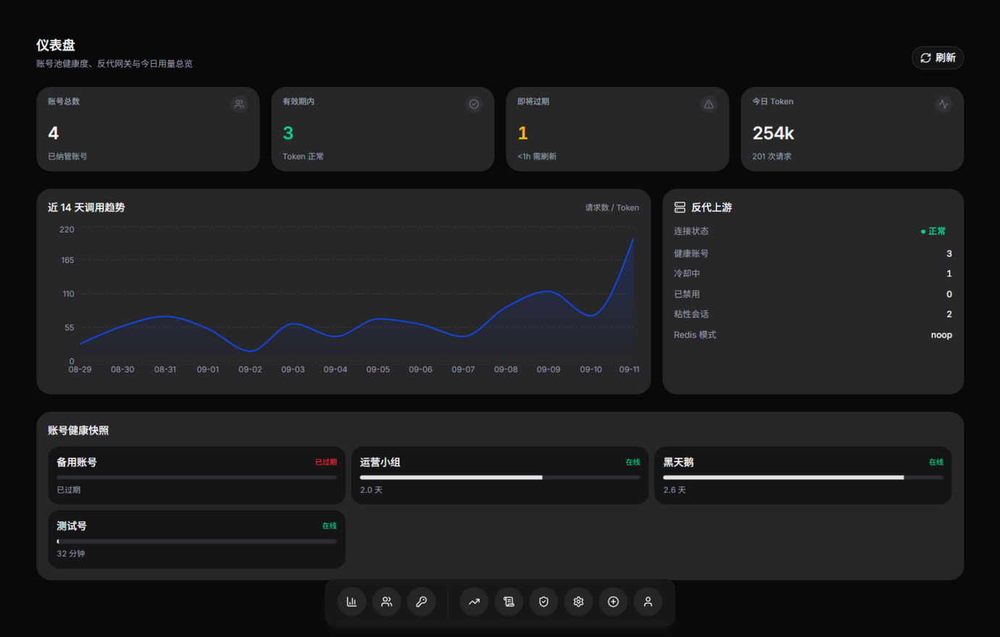
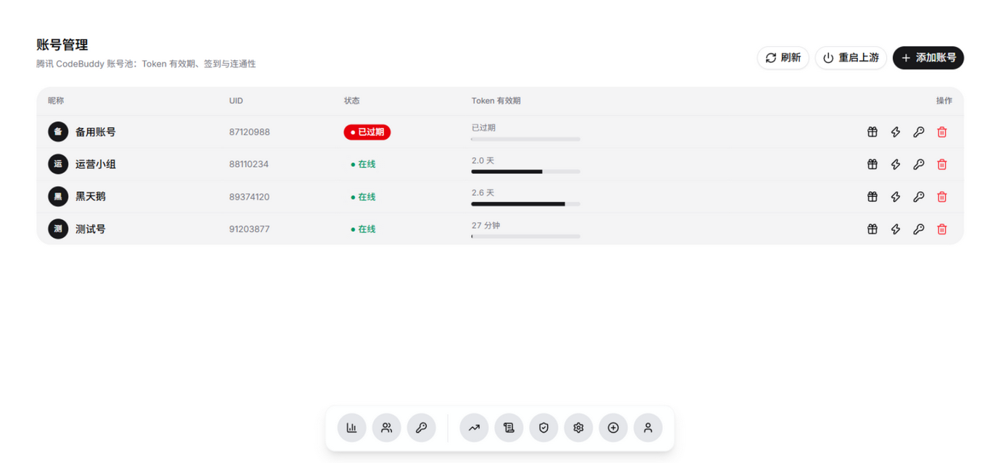
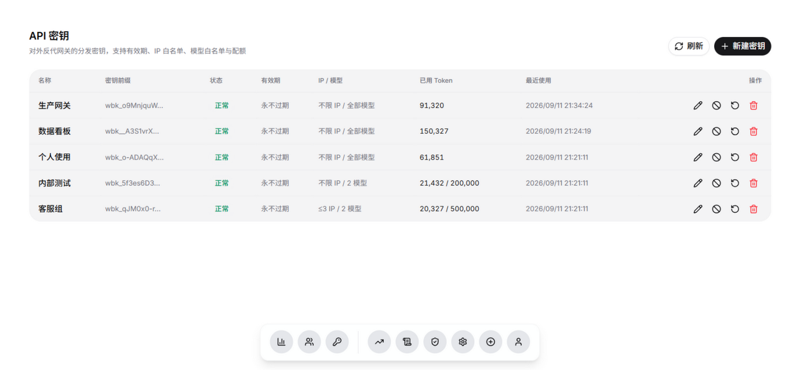
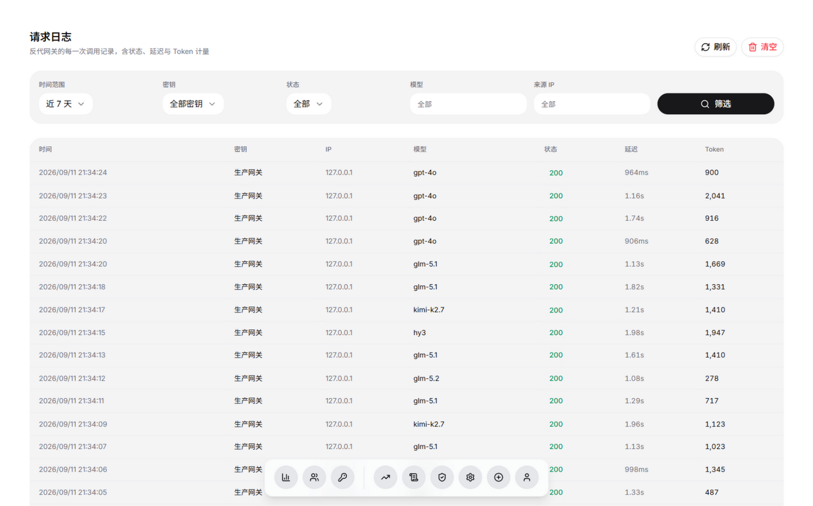
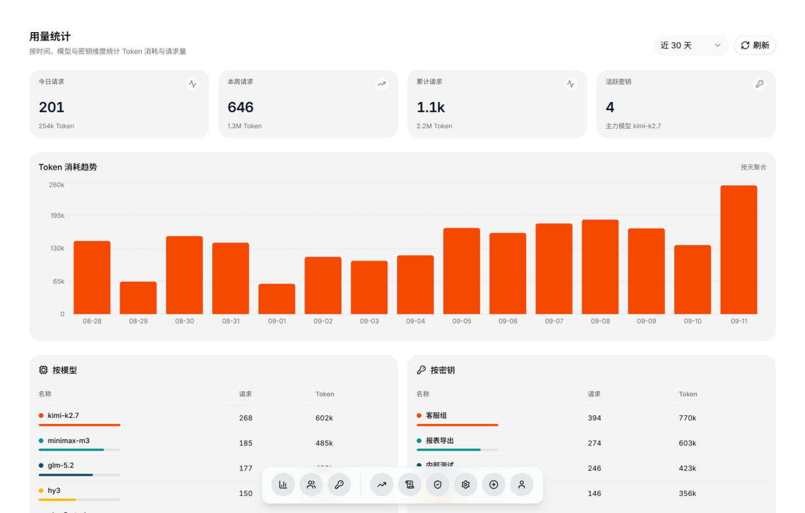
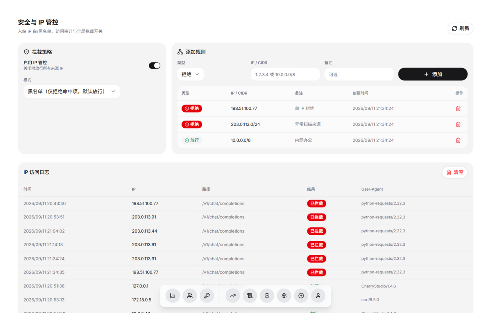
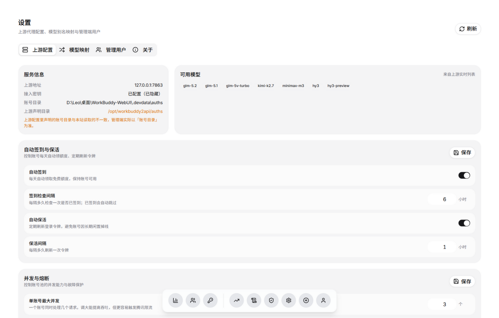

<div align="center">

# WorkBuddy Manager

**腾讯 CodeBuddy 账号池管理控制台 · OpenAI 兼容反代网关**

一套给 [`workbuddy2api`](https://github.com/Sliverkiss/workbuddy2api) 配套的 Web 管理端：
扫码批量纳管账号、自动签到、密钥分发、IP 管控、调用日志与用量统计，一个面板全搞定。




</div>

---

## 这是什么

[`workbuddy2api`](https://github.com/Sliverkiss/workbuddy2api) 是一个把腾讯 CodeBuddy 账号池包装成 OpenAI 兼容接口的反代服务（Go 编写）。它很强大，但**只有命令行**：加账号要跑脚本、看状态要 `curl /status`、发密钥没有任何界面。

本项目补上这一块 —— 一个可以公网运营的 Web 控制台：

| 你原本要做的 | 现在在面板上 |
|---|---|
| 服务器上跑 `login.sh` 扫码加号 | 点「添加账号」扫码，自动签到并纳管 |
| `curl /status` 看哪个号挂了 | 仪表盘实时展示健康度、冷却、有效期 |
| 手动改 `config.json` 调签到/并发 | 中文可视化设置，开关 + 数字框 |
| 所有下游共用一个全局 Key | 多密钥分发，各自独立配额、IP 与模型白名单 |
| 无法知道谁用了多少 | 每次调用的模型、Token、延迟、来源 IP 全量留痕 |
| 无任何 IP 防护 | 入站白/黑名单 + 每密钥 IP 上限与白名单 |

> **不改动 workbuddy2api 一行代码**。账号轮询、并发、熔断仍由它负责，本项目管理端与网关独立部署。

---

## 功能一览

### 账号管理
- **扫码纳管** —— 微信 / QQ 扫码授权，成功后自动每日签到、写入授权文件、重载上游容器
- **Token 监控** —— 有效期进度条，即将过期（<1h）自动预警；一键手动签到、连通性探测、刷新令牌
- **运行时状态** —— 与上游账号池状态合并展示（在线 / 冷却中 / 已禁用 / 已过期）

### 反代网关（对外 `/v1`）
- **OpenAI 兼容** —— 下游用标准 SDK 直连，支持流式（SSE）与非流式
- **多密钥分发** —— 每把密钥独立设置有效期、最大 IP 数、IP 白名单、模型白名单、Token 配额
- **密钥安全** —— 库中仅存 SHA-256 哈希，明文只在创建时展示一次
- **模型别名映射** —— 把 `gpt-4o-mini` 之类映射到实际模型，方便下游无感迁移
- **入站 IP 管控** —— 全局白/黑名单（支持 CIDR），白名单模式可做到只放行可信来源
- **全量审计** —— 每次调用记录密钥、IP、模型、状态码、延迟与 Token 消耗

### 可视化设置
- 签到与保活：开关 + 间隔，附白话说明，不再手改 JSON
- 并发与熔断：单账号并发、失败阈值、冷却时间
- 只提交改动项，不会误覆盖未展示的配置；冷门参数保留「高级设置」直接编辑
- 读取失败时明确提示原因并锁定保存，**杜绝空配置覆盖真实文件**

### 访问控制
- 管理端用户名 + 密码登录，PBKDF2-SHA256 加盐存储
- 角色分级：`admin` 可读写，`viewer` 只读（适合给同事看状态）
- HttpOnly 签名 Cookie 会话，同 IP 连续失败 5 次锁定 10 分钟

---

## 界面预览

### 仪表盘
> 账号健康度、上游连接状态、近 14 天调用趋势


<details>
<summary><b>深色模式</b>（点击展开）</summary>



</details>

### 账号管理
> 扫码添加、Token 有效期进度、签到 / 测活 / 刷新 / 删除



### API 密钥
> 独立配额、IP 限制、模型白名单，明文仅创建时展示一次



### 请求日志
> 按时间 / 密钥 / 状态 / 模型 / IP 筛选，含延迟与 Token 计量



### 用量统计
> 按天、按模型、按密钥多维统计 Token 消耗



### 安全与 IP 管控
> 全局白/黑名单、CIDR 规则、访问审计与拦截记录



### 设置
> 上游配置可视化，中文说明 + 开关 / 数字框



---

## 架构

```
   下游客户端 / sub2api（OpenAI SDK）
              │  Authorization: Bearer wbk_xxx
              ▼
   ┌──────────────────────────────────────────────┐
   │  WorkBuddy Manager                     :7864 │
   │  ┌────────────────────────────────────────┐  │
   │  │ 反代网关  /v1  /v2  /healthz           │  │
   │  │  密钥鉴权 → IP 管控 → 模型映射          │  │
   │  │  → 流式转发 → 日志与用量落库(SQLite)    │  │
   │  ├────────────────────────────────────────┤  │
   │  │ 管理接口  /api/*                       │  │
   │  │  登录 / 账号 / 密钥 / 日志 / 用量        │  │
   │  │  / 安全 / 设置                          │  │
   │  ├────────────────────────────────────────┤  │
   │  │ Web 前端（Next.js 静态导出）            │  │
   │  └────────────────────────────────────────┘  │
   └───────────────┬──────────────────────────────┘
                   │ 复用 auths/*.json  调用 /status /v1/models
                   ▼
   ┌──────────────────────────────────────────────┐
   │  workbuddy2api（Go，不改动）            :7863 │
   │  账号轮询 · 并发调度 · 熔断 · 令牌刷新          │
   └───────────────┬──────────────────────────────┘
                   ▼
        腾讯 CodeBuddy / copilot.tencent.com
```

**单进程单端口**：前端由 `next build` 静态导出，交由 FastAPI 托管，`/api` 与 `/v1` 同源，无需 CORS。

**技术栈**

| 层 | 选型 |
|---|---|
| 前端 | Next.js 15（App Router）· React 19 · TypeScript · shadcn/ui · Tailwind CSS v4 · motion · recharts · sonner |
| 后端 | Python 3.11+ · FastAPI · uvicorn · httpx · SQLite（标准库，无重依赖） |
| 部署 | systemd 常驻 + 1Panel 反向代理 + Let's Encrypt HTTPS |

---

## 快速开始

### 一、本地开发

```bash
# 0) 可选：本机没有真实的 workbuddy2api 时，起一个模拟上游
#    自带模型列表与示例账号，便于查看完整界面
python dev/mock_upstream.py         # 监听 127.0.0.1:7863

# 1) 后端（终端 A）
python -m pip install -r server/requirements.txt
WB_ADMIN_PASSWORD=admin123 \
WB_DATA_DIR=./data \
WB_AUTH_DIR=/opt/workbuddy2api/auths \
WB2API_BASE=http://127.0.0.1:7863 \
python -m uvicorn server.main:app --reload --port 7864

# 2) 前端（终端 B）—— next dev 会把 /api、/v1 反代到 :7864
cd web
npm install
npm run dev                          # http://localhost:3000
```

首次启动会自动生成 `users.json` 与随机签名密钥。若未设置 `WB_ADMIN_PASSWORD`，会在日志中打印一次随机管理员密码。

> **代理注意事项**
> 若本机装有代理软件（Clash / V2Ray 等），**尤其是 TUN 模式**，访问 `127.0.0.1:7863` 可能被代理劫持，表现为接口长时间无响应。
> 本项目对内部请求默认 `trust_env=False`（不读取系统代理）；确需走代理时设置 `WB_HTTP_PROXY`。
> TUN 模式下请在代理软件中把 `127.0.0.1` 加入直连 / 绕过列表。

### 二、部署到服务器（Ubuntu + 1Panel）

```bash
# 本地先构建静态前端（产物 web/out 不入库）
cd web && npm install && npm run build:export

# 上传仓库到服务器后
sudo bash deploy/install.sh          # 安装依赖 + 注册 systemd 服务
journalctl -u workbuddy-web -f       # 查看首次生成的管理员密码
```

**1Panel 反向代理**：网站 → 创建反向代理 → 域名 `wb.example.com` → 目标 `http://127.0.0.1:7864`
→ 申请 Let's Encrypt 证书并开启强制 HTTPS。

<details>
<summary><b>环境变量一览</b></summary>

| 变量 | 默认 | 说明 |
|---|---|---|
| `WB_MANAGER_PORT` | `7864` | 监听端口 |
| `WB2API_BASE` | `http://127.0.0.1:7863` | workbuddy2api 地址 |
| `WB2API_KEY` | 读 config.json | 上游 API Key |
| `WB2API_CONTAINER` | `workbuddy2api` | 重载用的容器名 |
| `WB_AUTH_DIR` | `/opt/workbuddy2api/auths` | 账号授权目录 |
| `WB_UPSTREAM_CONFIG` | `/opt/workbuddy2api/config.json` | 上游配置文件 |
| `WB_DATA_DIR` | `./data` | 本服务数据目录 |
| `WB_STATIC_DIR` | `./web/out` | 静态导出目录 |
| `WB_ADMIN_PASSWORD` | 随机生成 | 首次启动的 admin 密码 |
| `WB_SECURE_COOKIE` | `auto` | 依 `X-Forwarded-Proto` 判定 |
| `WB_HTTP_PROXY` | 空 | 出口代理，留空 = 全部直连 |

完整清单见 [`.env.example`](.env.example)。

</details>

---

## 使用指南

### 1. 纳管账号

登录后进入「账号」页，点右上角 **添加账号** → 用微信 / QQ 扫码 → 授权成功后自动签到、落盘并重载上游容器。

### 2. 分发密钥

进入「密钥」页点 **新建密钥**，按需设置：

- **有效期** —— 留空或 0 表示永不过期
- **最大 IP 数** —— 限制同一密钥可使用的来源 IP 数量
- **IP 白名单** —— 更严格，仅允许指定 IP / CIDR 调用
- **模型白名单** —— 限制该密钥可用的模型
- **配额** —— Token 用尽后自动拒绝

密钥明文**只在创建时展示一次**，请立即保存。

### 3. 下游接入

完全兼容 OpenAI 协议，Base URL 指向本服务的 `/v1`：

```bash
curl https://wb.example.com/v1/chat/completions \
  -H "Authorization: Bearer wbk_xxxxxxxx" \
  -H "Content-Type: application/json" \
  -d '{
    "model": "glm-5.2",
    "messages": [{"role": "user", "content": "你好"}],
    "stream": true
  }'
```

Python 示例：

```python
from openai import OpenAI

client = OpenAI(
    base_url="https://wb.example.com/v1",
    api_key="wbk_xxxxxxxx",
)

resp = client.chat.completions.create(
    model="glm-5.2",
    messages=[{"role": "user", "content": "你好"}],
    stream=True,
)
for chunk in resp:
    print(chunk.choices[0].delta.content or "", end="")
```

> 流式请求会自动注入 `stream_options.include_usage=true`，以便精确统计 Token 消耗。

<details>
<summary><b>可用模型</b></summary>

以「设置 → 可用模型」实时拉取结果为准，常见如下（上下文均为 131072）：

`glm-5.2` · `glm-5.1` · `glm-5v-turbo` · `kimi-k2.7` · `minimax-m3` · `hy3` · `hy3-preview`

</details>

---

## 接口说明

| 方法 | 路径 | 鉴权 | 说明 |
|---|---|---|---|
| `POST` | `/v1/chat/completions` | 网关密钥 | OpenAI 兼容对话（流式 / 非流式） |
| `POST` | `/v2/chat/completions` | 网关密钥 | 同上（v2 路径） |
| `GET` | `/v1/models` | 网关密钥 | 模型列表 |
| `GET` | `/healthz` | 无 | 存活探测（含上游连通性） |
| `GET` | `/api/me` | 会话 | 当前登录用户 |
| `POST` | `/api/login` `/api/logout` | 无 | 登录 / 登出 |
| `GET` | `/api/accounts` | 会话 | 账号列表 |
| `POST` | `/api/auth/start` `/api/auth/poll` | 管理员 | 扫码授权流程 |
| `POST` | `/api/accounts/{file}/checkin` `/test` `/refresh` | 管理员 | 签到 / 测活 / 刷新 |
| `DELETE` | `/api/accounts/{file}` | 管理员 | 删除账号 |
| `GET/POST/PATCH/DELETE` | `/api/keys[/{id}]` | 会话 / 管理员 | 密钥管理 |
| `GET` | `/api/logs` `/api/stats/*` | 会话 | 日志与用量 |
| `GET/POST/DELETE` | `/api/security/*` | 会话 / 管理员 | IP 规则与审计 |
| `GET/POST` | `/api/settings/*` | 会话 / 管理员 | 上游配置、模型映射 |

管理端接口细节可在服务启动后访问 `/docs` 查看（Swagger UI）。

---

## 目录结构

```
workbuddy-manager/
├─ server/                       # FastAPI 后端
│  ├─ main.py                    # 入口：路由注册 + 静态托管
│  ├─ config.py                  # 全部环境变量与 http_client 工厂
│  ├─ db.py                      # SQLite（密钥/日志/用量/IP/设置）
│  ├─ security.py                # PBKDF2 + 签名 Cookie + 防爆破
│  ├─ keysvc.py                  # 密钥生成、校验、限额判定
│  ├─ iputil.py                  # 真实 IP 解析 + CIDR 匹配
│  ├─ services/
│  │  ├─ tencent.py              # 腾讯登录 / 签到 / 探测协议
│  │  └─ wb2api.py               # workbuddy2api 交互
│  └─ routers/                   # auth accounts keys logs stats security settings gateway
├─ web/                          # Next.js 15 前端
│  ├─ app/(main)/                # dashboard accounts keys logs stats security settings
│  ├─ app/(auth)/login/          # 登录页
│  ├─ components/ui/             # shadcn 原语（含 floating-dock）
│  └─ components/common/         # 浮动底栏、统计卡、各业务组件
├─ dev/mock_upstream.py          # 本地联用的模拟上游
├─ deploy/                       # systemd unit + 一键部署脚本
└─ docs/                         # 设计与实现文档 + 界面截图
```

---

## 安全说明

- 网关密钥仅存 SHA-256 哈希，明文只在创建时返回一次
- 管理端密码使用 PBKDF2-SHA256（26 万次迭代）加盐存储
- 会话使用 HttpOnly + SameSite=Lax 签名 Cookie，生产环境自动启用 `Secure`
- 同 IP 登录失败 5 次锁定 10 分钟
- 所有文件操作做路径穿越校验
- `users.json`、`data/*.db`、`.env`、账号授权文件均已在 `.gitignore` 中排除

> ⚠️ 公网暴露**必须**启用 HTTPS，否则会话 Cookie 与密码可被中间人窃取。
> 建议再叠加 1Panel IP 白名单或 Cloudflare Access 加固。

---

## 已知限制

- **出站 IP 池未包含**：当前仅做**入站** IP 管控。若要为每个腾讯账号绑定独立**出口 IP / 代理**（上游请求由 workbuddy2api 发出），需要在其 Go 服务侧增加代理池支持，不在本仓库范围内。
- 请求的**请求体 / 响应体内容不做留存**，仅记录元数据（模型、状态、Token、延迟、来源），以保护隐私。
- 用量统计按「天 × 密钥 × 模型」聚合；如需小时粒度可扩展 `usage_daily` 表。

---

## 致谢

- [**linux-do/cdk**](https://github.com/linux-do/cdk)（MIT）—— 界面设计令牌与浮动底栏组件来源，本项目 UI 视觉与其保持一致
- [**Sliverkiss/workbuddy2api**](https://github.com/Sliverkiss/workbuddy2api) —— 底层账号池与 OpenAI 兼容代理
- [**lbjlaq/Antigravity-Manager**](https://github.com/lbjlaq/Antigravity-Manager) —— 管理端功能形态参考

## License

[MIT](LICENSE)
